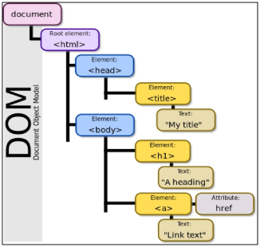
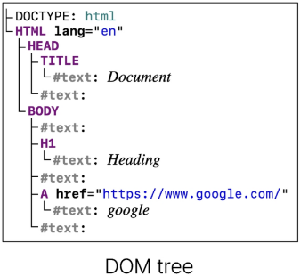
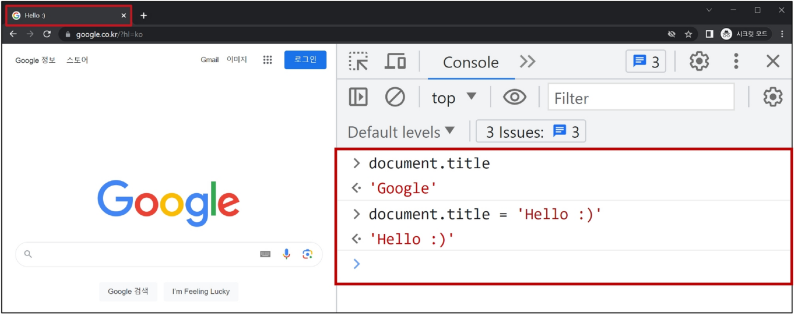
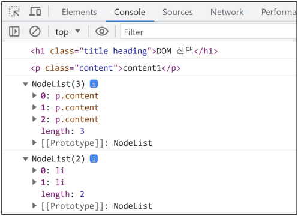

# DOM
## Dom 개요
- 웹 브라우저에서의 JavaScript
    - 웹 페이지의 동적인 기능을 구현
- JavaScript 실행 환경 종류
    1. HTML script 태그
        ```html
        <body>
          <script>
            console.log('hello')
          </script>
        </body>
        ```
    2. js 확장자 파일
        ```js
        // hello.js
        console.log('hello')
        ```
        ```html
        <body>
          <script src="hello.js"></script>
        </body>
        ```
    3. 브라우저 Console
        ```
        > console.log('hello')
        hello
        ```
## DOM (The Document Object Model)
- 웹 페이지(Document)를 구조화된 객체로 제공하여<br>
프로그래밍 언어가 페이지 구조에 접근할 수 있는 방법을 제공
    - 문서 구조, 스타일, 내용 등을 변경할 수 있도록 함

## DOM 특징
- DOM에서 모든 요소, 속성, 텍스트는 하나의 객체
- 모두 document 객체의 자식으로 구성됨<br>


## DOM tree
- 브라우저는 HTML 문서를 해석하여 DOM tree라는 객체 트리로 구조화
    - 객체 간 상속 구조가 존재

```html
<!DOCTYPE html>
<html lang="en">
  
<head>
<title>Document</title>
</head>

<body>
  <h1>Heading</h1>
  <a href="https://www.google.com">google</a>
</body>

</html>
```


## 브라우저가 웹 페이지를 불러오는 과정
- 웹 페이지는 웹 브라우저를 통해 해석되어 웹 브라우저 화면에 나타남

## DOM 핵심
- 문서의 요소들을 객체로 제공하여 다른 프로그래밍 언어에서<br>
접근하고 조작할 수 있는 방법을 제공하는 API

# document 객체
## 'document' 객체
- 웹 페이지 객체
- DOM Tree의 진입점
- 페이지를 구성하는 모든 객체 요소를 포함

## 'document' 객체 예시
- HTML의 `<title>` 변경하기


# DOM 선택
## DOM 조작 시 기억해야 할 것
- 웹 페이지를 동적으로 만들기 == 웹 페이지를 조작하기
- 조작 순서
    1. 조작 하고자 하는 요소를 <span style="color:red">선택</span> (또는 탐색)
    2. 선택된 요소의 콘텐츠 또는 <span style="color:red">속성</span>을 조작

# 선택 메서드
## 선택 메서드
- `document.querySelector()`
    - 요소 한 개 선택
- `document.querySelectorAll()`
    - 요소 여러 개 선택

## `document.querySelector(selector)`
- 제공한 선택자와 일치하는 element 한 개 선택
    - 제공한 CSS selector를 만족하는<br>
    첫 번째 element 객체를 반환 (없다면 null 반환)

## `document.querySelectorAll(selector)`
- 제공한 선택자와 일치하는 여러 elemet를 선택
    - 제공한 CSS selector를 만족하는 NodeList를 반환

## DOM 선택 실습
```html
<!-- select.html -->

<body>
  <h1 class="heading">DOM 선택</h1>
  <a href="https://www.google.com/">google</a>
  <p class="content">constent1</p>
  <p class="content">constent2</p>
  <p class="content">constent3</p>
  <ul>
    <li>list1</li>
    <li>list2</li>
  </ul>
  <script>
    console.log(document.querySelector('.heading'))
    console.log(document.querySelector('.content'))
    console.log(document.querySelectorAll('.content'))
    console.log(document.querySelectorAll('ul > li'))
  </script>
</body>
```

