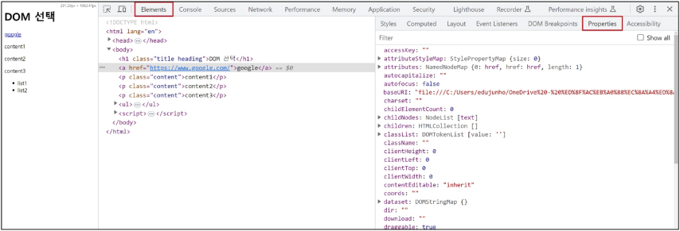
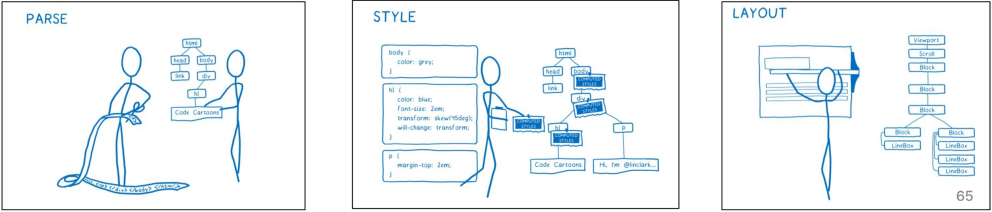

# DOM
## Dom 개요
- 웹 브라우저에서의 JavaScript
    - 웹 페이지의 동적인 기능을 구현
- JavaScript 실행 환경 종류
    1. HTML script 태그
        ```html
        <body>
          <script>
            console.log('hello')
          </script>
        </body>
        ```
    2. js 확장자 파일
        ```js
        // hello.js
        console.log('hello')
        ```
        ```html
        <body>
          <script src="hello.js"></script>
        </body>
        ```
    3. 브라우저 Console
        ```
        > console.log('hello')
        hello
        ```
## DOM (The Document Object Model)
- 웹 페이지(Document)를 구조화된 객체로 제공하여<br>
프로그래밍 언어가 페이지 구조에 접근할 수 있는 방법을 제공
    - 문서 구조, 스타일, 내용 등을 변경할 수 있도록 함

## DOM 특징
- DOM에서 모든 요소, 속성, 텍스트는 하나의 객체
- 모두 document 객체의 자식으로 구성됨<br>


## DOM tree
- 브라우저는 HTML 문서를 해석하여 DOM tree라는 객체 트리로 구조화
    - 객체 간 상속 구조가 존재

```html
<!DOCTYPE html>
<html lang="en">
  
<head>
<title>Document</title>
</head>

<body>
  <h1>Heading</h1>
  <a href="https://www.google.com">google</a>
</body>

</html>
```


## 브라우저가 웹 페이지를 불러오는 과정
- 웹 페이지는 웹 브라우저를 통해 해석되어 웹 브라우저 화면에 나타남

## DOM 핵심
- 문서의 요소들을 객체로 제공하여 다른 프로그래밍 언어에서<br>
접근하고 조작할 수 있는 방법을 제공하는 API

# document 객체
## 'document' 객체
- 웹 페이지 객체
- DOM Tree의 진입점
- 페이지를 구성하는 모든 객체 요소를 포함

## 'document' 객체 예시
- HTML의 `<title>` 변경하기


# DOM 선택
## DOM 조작 시 기억해야 할 것
- 웹 페이지를 동적으로 만들기 == 웹 페이지를 조작하기
- 조작 순서
    1. 조작 하고자 하는 요소를 <span style="color:red">선택</span> (또는 탐색)
    2. 선택된 요소의 콘텐츠 또는 <span style="color:red">속성</span>을 조작

# 선택 메서드
## 선택 메서드
- `document.querySelector()`
    - 요소 한 개 선택
- `document.querySelectorAll()`
    - 요소 여러 개 선택

## `document.querySelector(selector)`
- 제공한 선택자와 일치하는 element 한 개 선택
    - 제공한 CSS selector를 만족하는<br>
    첫 번째 element 객체를 반환 (없다면 null 반환)

## `document.querySelectorAll(selector)`
- 제공한 선택자와 일치하는 여러 elemet를 선택
    - 제공한 CSS selector를 만족하는 NodeList를 반환

## DOM 선택 실습
```html
<!-- select.html -->

<body>
  <h1 class="heading">DOM 선택</h1>
  <a href="https://www.google.com/">google</a>
  <p class="content">constent1</p>
  <p class="content">constent2</p>
  <p class="content">constent3</p>
  <ul>
    <li>list1</li>
    <li>list2</li>
  </ul>
  <script>
    console.log(document.querySelector('.heading'))
    console.log(document.querySelector('.content'))
    console.log(document.querySelectorAll('.content'))
    console.log(document.querySelectorAll('ul > li'))
  </script>
</body>
```


# DOM 조작
## 속성 조작
1. 클래스 속성 조작
2. 일반 속성 조작

## 클래스 속성 조작
`classList` property
- 요소의 클래스 목록을 DOMTokenList(유사 배열) 형태로 반환

## `classList` 메서드
- `element.classList.add()`
    - 지정한 클래스 값을 추가
- `element.classList.remove()`
    - 지정한 클래스 값을 제거
- `element.classList.toggle()`
    - 클래스가 존재한다면 제거하고 false를 반환<br>
    (존재하지 않으면 클래스를 추가하고 true 반환)

## 클래스 속성 조작 실습
[02-element-manipulation.html](./01-intro-and-DOM/02-element-manipulation.html)

## 속성 조작 메서드
- `Element.getAttribute()`
    - 해당 요소에 지정된 값을 반환 (조회)

- `Element.setAttribute(name, value)`
    - 지정된 요소의 속성 값을 반환
    - 속성이 이미 있으면 기존 값을 갱신 (그렇지 않으면 지정된 이름과 값으로 새 속성이 추가)

- `Element.removeAttribute()`
    - 요소에서 지정된 이름을 가진 속성 제거

## 속성 조작 실습
[02-element-manipulation.html](./01-intro-and-DOM/02-element-manipulation.html)

# HTML 콘텐츠 조작
## HTML 콘텐츠 조작
- `textContent` property
    - 요소의 텍스트 콘텐츠를 표현

## HTML 콘텐츠 조작 실습
[03-contents-manipulation.html](./01-intro-and-DOM/03-contents-manipulation.html)

# DOM 요소 조작
## DOM 요소 조작 메서드
- `document.createElement(tagName)`
    - 작성한 tagName의 HTML 요소를 생성하여 반환

- `Node.appendChild()`
    - 한 Node를 특정 부모 Node의 자식 NodeList 중 마지막 자식으로 삽입
    - 추가된 Node 객체를 반환

- `Node.removeChild()`
    - DOM에서 자식 Node를 제거
    - 제거된 Node를 반환

## DOM 요소 조작 실습
[04-dom-manipulation.html](./01-intro-and-DOM/04-dom-manipulation.html)

# style 조작
- `style` property
    - 해당 요소의 모든 style 속성 목록을 포함하는 속성

## style 조작 실습
[05-style-property.html](./01-intro-and-DOM/05-style-property.html)

# 참고
## Node
- DOM의 기본 구성 단위
- DOM 트리의 각 부분은 Node라는 객체로 표현됨
    - Document Node => HTML 문서 전체를 나타내는 노드
    - Element Node => HTML 요소를 나타내는 노드 ex> `<p>`
    - Text Node => HTML 텍스트, Element Node 내의 텍스트 컨텐츠를 나타냄
    - Attribute Node => HTML 요소의 속성을 나타내는 노드

## NodeList
- DOM 메서드를 사용해 선택한 Node의 목록
- 배열과 유사한 구조를 가짐
- Index로만 각 항목에 접근 가능
- 다양한 배열 메서드 사용 가능
- `querySelectorAll()`에 의해 반환되는 NodeList는 DOM의 변경사항을 실시간으로 반영하지 않음

## Element
- Node의 하위 유형
- Element는 DOM 트리에서 HTML 요소를 나타내는 특별한 유형의 Node
- 예를 들어, `<p>`, `<div>`, `<span>`, `<body>` 등의 HTML 태그들이 Element 노드를 생성
- Node의 속성과 메서드를 모두 가지고 있으며 추가적으로 요소 특화된 기능<br>
(예: className, innerHTML, id 등)을 가지고 있음
- 모든 Element는 Node이지만, 모든 Node가 Element인 것은 아님

## DOM 속성 확인 Tip
- 개발자도구 - Emelemts - Properties
- 해당 요소의 모든 DOM 속성 확인 가능


## Parsing (구문 분석, 해석)
- 브라우저가 문자열을 해석하여 DOM Tree로 만드는 과정

