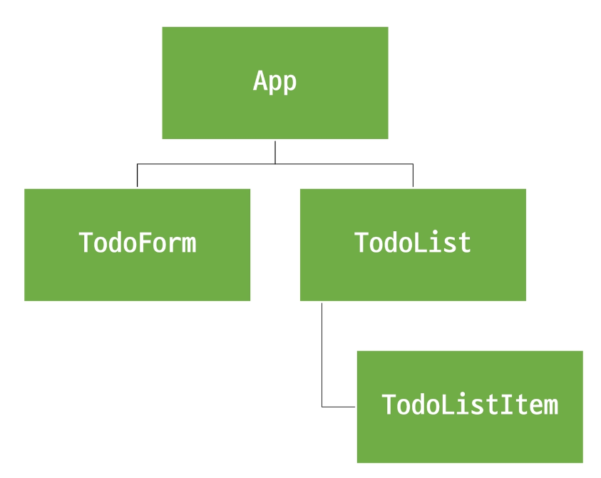

# State Management
## State Management (상태관리)
- Vue 컴포넌트는 이미 반응형 상태를 관리하고 있음
- 상태 === 데이터

## 컴포넌트 구조의 단순화
- 상태(State)
    - 앱 구동에 필요한 기본 데이터
- 뷰(View)
    - 상태를 선언적으로 매핑하여 시각화
- 기능(Actions)
    - 뷰에서 사용자 입력에 대해 반응적으로 상태를 변경할 수 있게 정의된 동작

```vue
<template>
  <!-- 뷰(view) -->
  <div>{{ count }}</div>
</template>

<script setup>
import { ref } from 'vue'

// 상태(State)
const count = ref(0)

// 기능(Actions)
const increment = function () {
  count.value++
}
</script>
```

- "단방향 데이터 흐름"의 간단한 표현

## 상태 관리의 단순성이 무너지는 시점
- "여러 컴포넌트가 상태를 공유할 때"
    1. 여러 뷰가 동일한 상태에 종속되는 경우
    2. 서로 다른 뷰의 기능이 동일한 상태를 변경시켜야 하는 경우

1. 여러 뷰가 동일한 상태에 종속되는 경우
    - 공유 상태를 공통 조상 컴포넌트로 "끌어올린"다음 props로 전달하는 것
    - 하지만 계층 구조가 깊어질 경우 비효율적, 관리가 여려워 짐

2. 서로 다른 뷰의 기능이 동일한 상태를 변경시켜야 하는 경우
    - 발신(emit)된 이벤트를 통해 상태의 여러 복사본을 변경 및 동기화 하는 것
    - 마찬가지로 관리의 패턴이 깨지기 쉽고 유지 관리할 수 없는 코드가 됨

## 해결책
- 각 컴포넌트의 공유 상태를 추출하여, 전역에서 참조할 수 있는 저장소에서 관리
- 컴포넌트 트리는 하나의 큰 "뷰"가 되고 모든 컴포넌트는 트리 계층 구조에<br>
관계 없이 상태에 접근하거나 이능을 사용할 수 있음
- Vue의 공식 상태 관리 라이브러리 === <span style='color: red'>"Pinia"</span>

# State management library (Pinia)
# Pinia
- Vue 공식 상태 관리 라이브러리

## Pinia 설치
- Vite 프로젝트 빌드 시 Pinia 라이브러리 추가

# Pinia 구조
## Pinia 구성 요소
1. store
2. state
3. getters
4. actions
5. plugin

## Pinia 구성 요소 = `store`
- 중앙 저장소
- 모든 컴포넌트가 공유하는 상태, 기능 등이 작성됨
- 반응형 상태(데이터)
- `ref() === state`
- 계산된 값
- `computed() === getters`
- 메서드
- `function() === actions`
```js
import { ref, computed } from 'vue'
import { defineStore } from 'pinia'

export const useCounterStore = defineStore('counter', () => {

  const count = ref(0)

  const doubleCount = computed(() => count.value * 2)

  const increment = function () {
    count.value++
  }

  return { count, doubleCount, increment }
})
```

## Pinia 구성 요소 - `plugin`
- 애플리케이션의 상태 관리에 필요한 추가 기능을<br>
제공하거나 확장하는 도구나 모듈
- 애플리케이션의 상태 관리를 더욱 간편하고 유연하게 만들어주며<br>
패키지 매니저로 설치 이후 별도 설정을 통해 추가 됨

## Pinia 구성 요소 종합
- Pinia는 store라는 저장소를 가짐
- store는 `state`, `getters`, `actions`으로 이루어지며<br>
각각 `ref()`, `computed()`, `function()`과 동일함

## State
- store 인스턴스로 state에 접근하여 직접 읽고 쓸 수 있음
- 만약 store에 state를 정의하지 않았다면 컴포넌트에서 새로 추가할 수 없음
```vue
<!-- App.vue -->
<script>
import { useCounterStore } from '@/stores/counter'

const store = userCounterStore()

// state 참조 및 변경
console.log(store.count)
const newNumber = store.count + 1
</script>

<template>
  <div>
    <p>state : {{ store.count }}</p>
  </div>
</template>
```

## Getters
- store의 모든 getters를 state 처럼 접근 할 수 있음
```vue
<!-- App.vue -->
<script setup>
console.log(store.doubleCount)
</script>

<template>
  <div>
    <p>getters : {{ store.doubleCount }}</P>
  </div>
</template>
```

## Actions
- store의 모든 actions를 직접 접근 및 호출 할 수 있음
- getters와 달리 state 조작, 비동기, API 호출이나 다른 로직을 진행할 수 있음
```vue
<!-- App.vue -->

<script setup>
// actions 호출
store.increment()
</script>

<template>
  <div>
    <button @click="store.increment()">+++</button>
  </div>
</template>
```

# Pinia 실습
## Pinia를 활용한 Todo 프로젝트 구현
- Todo CRUD
- Todo 개수 계산
    - 전체 Todo
    - 완료된 Todo
    - 미완료된 Todo

## 컴포넌트 구성


# 사전준비
## 사전 준비
- 초기 생성된 컴포넌트 모두 삭제 (App.vue 제외)
- src/asstes 내부 파일 모두 삭제
- main.js 해당 코드 삭제
```js
//  main.js

import './assets/main.css'  // 삭제
```

- TodoListItem 컴포넌트 작성
```vue
<!-- TodoListItem.vue -->

<template>
  <div>
    TodoListItem
  </div>
</template>
```

- TodoList 컴포넌트 작성
- TodoListItem 컴포넌트 등록
```vue
<!-- TodoList.vue -->

<template>
  <div>
    <TodoListItem />
  </div>
</template>

<script setup>
import TodoListItem from '@/components/TodoListItem.vue'
</script>
```

- TodoForm 컴포넌트 작성
```vue
<!-- TodoForm.vue -->

<template>
  <div>
    TodoForm
  </div>
</template>
```

- App 컴포넌트에 TodoList, TodoForm 컴포넌트 등록
```vue
<!-- App.vue -->

<template>
  <div>
    <h1>Todo Project</h1>
    <TodoList />
    <TodoForm />
  </div>
</template>

<script setup>
import TodoForm from '@/components/TodoForm.vue'
import TodoList from '@/components/TodoList.vue'
</script>
```

# Read Todo
## Todo 조회
- store에 임시 todos 목록 상태를 정의
```js
// stores/counter.js

import { ref, computed } from 'vue'
import { defineStore } from 'pinia'

export const useCounterStore = defineStore('counter', () => {
  let id = 0
  const todos = ref([
    { id: id++, text: 'todo 1', isDone: false },
    { id: id++, text: 'todo 2', isDone: false },
  ])
  return { todos }
})
```
- store의 todos 상태를 참조
- 하위 컴포넌트인 TodoListItem을 반복 하면서 개별 todo를 props로 전달
```vue
<!-- TodoList.vue -->

<script setup>
import { useCounterStore } from '@/stores/counter'
import TodoListItem from '@/components/TodoListItem.vue'

const store = useCounterStore()
</script>

<template>
  <div>
    <TodoListItem
      v-for="todo in store.todos"
      :key="todo.id"
      :todo="todo"
    />
  </div>
</template>
```
- props 정의 후 데이터 출력 확인
```vue
<template>
  <div>{{ todo.text }}</div>
</template>

<script setup>
defineProps({
  todo: Object
})
</script>
```

# Create Todo
## Todo 생성
- todos 목록에 todo를 생성 및 추가하는 addTodo 액션 정의
```js
// stores/counter.js

const addTodo = function (todoText) {
  todos.value.push({
    id: id++,
    text: todoText,
    isDone: false
  })
}

return { todos, addTodo }
```
- TodoForm에서 실시간으로 입력되는 사용자 데이터를<br>
양방향 바인딩하여 반응형 변수로 할당
```vue
<!-- TodoForm.vue -->
<template>
  <div>
    <form>
      <input type="text" v-model="todoText">
      <input type="submit">
    </form>
  </div>
</template>

<script setup>
import { ref } from 'vue'

const todoText = ref('')
</script>
```
- submit 이벤트가 발생 했을 때 사용자 입력 텍스트를 인자로 전달하여<br>
store에 정의한 addTodo 액션 메서드를 호출
```vue
<!-- TodoForm.vue -->
<template>
  <div>
    <form @submit.prevent="createTodo(todoText)">
      <input type="text" v-model="todoText">
      <input type="submit">
    </form>
  </div>
</template>

<script setup>
import { useCounterStore } from '@/stores/counter'

const store = useCounterStore()

const createTodo = function (todoText) {
  store.addTodo(todoText)
}
</script>
```
- form 요소를 선택하여 todo 입력 후<br>
input 데이터를 초기화 할 수 있도록 처리
```vue
<template>
  <div>
    <form @submit.prevent="createTodo(todoText)" ref="formElem">
      <input type="text" v-model="todoText">
      <input type="submit">
    </form>
  </div>
</template>

<script setup>
const formElem = ref(null)

const createTodo = function (todoText) {
  store.addTodo(todoText)
  formElem.value.reset()
}
</script>
```
- 결과 확인

# Delete Todo
## Todo 삭제
- todos 목록에서 특정 todo를 삭제하는 deleteTodo 액션 정의
```js
// stores/counter.js

const deleteTodo = function () {
  console.log('delete')
}

return { todos, addTodo, deleteTodo }
```
- 각 todo에 삭제 버튼을 작성
- 버튼을 클릭하면 선택된 todo의 id를 인자로 전달해 deleteTodo 메서드 호출
```vue
<template>
  <div>
    <span>{{ todo.text }}</span>
    <button @click="store.deleteTodo(todo.id)">Delete</button>
  </div>
</template>

<script setup>
import { useCounterStore } from '@/stores/counter'

const store = useCounterStore()
</script>
```
- 전달받은 todo의 id 값을 활용해 선택된 todo의 인덱스를 구함
- 특정 인덱스 todo를 삭제 후 todos 배열을 재설정
```js
// store/counter.js

const deleteTodo = function (todoId) {
  const index = todos.value.findIndex((todo) => todo.id === todoId)
  todos.value.splice(index, 1)
}

return { todos, addTodo, deleteTodo }
```

# Update Todo
## Todo 수정
- 각 todo 상태의 isDone 속성을 변경하여 todo의 완료 유무 처리하기
- 완료된 todo에는 취소선 스타일 적용하기
- todos 목록에서 특정 todo의 isDone 속성을 변경하는 updateTodo 액션 정의
```js
// stores/counter.js

const updateTodo = function () {
  console.log('update')
}

return { todos, addTodo, deleteTodo, updateTodo }
```
- todo 내용을 클릭하면 선택된 todo의 id를 인자로 전달해<br>
updateTodo 메서드를 호출
```vue
<!-- TodoListItem.vue -->

<template>
  <div>
    <span @click="store.updateTodo(todo.id)">
      {{ todo.text }}
    </span>
    <button @click="store.deleteTodo(todo.id)">Delete</button>
  </div>
</template>
```
- 전달받은 todo의 id 값을 활용해 선택된 todo와 동일 todo를 목록에서 검색
- 일치하는 todo 데이터의 isDone 속성 값을 반대로 재할당 후 새로운 todo 목록 반환
```js
// store/counter.js

const updateTodo = function (todoId) {
  todos.value = todos.value.map((todo) => {
    if (todo.id === todoId) {
      todo.isDone = !todo.isDone
    }
    return todo
  })
}
```
- todo 객체의 isDone 속성 값에 따라 스타일 바인딩 적용하기
```vue
<!-- TodoListItem.vue -->

<template>
  <span @click="store.updateTodo(todo.id)" :class="{ 'is-done': todo.isDone }">
    {{ todo.text }}
  </span>
</template>

<style scoped>
.is-done {
  text-decoration: line-through;
}
</style>
```
- 결과 확인

# Computed Todo
## 완료된 todo 개수 계산
- todos 배열의 길이 값을 반환하는 함수 doneTodosCount 작성 (getters)
```js
// stores/counter.js

const doneTodosCount = computed(() => {
  return todos.value.filter((todo) => todo.isDone)
})

return { todos, addTodo, deleteTodo, updateTodo, doneTodosCount }
```
- App 컴포넌트에서 doneTodosCount getter를 참조
```vue
<template>
  <div>
    <h1>Todo Project</h1>
    <h2>완료된 Todo : {{ store.doneTodosCount }}</h2>
    <TodoList />
    <TodoForm />
  </div>
</template>

<script setup>
import { useCounterStore } from '@/stores/counter'

const store = useCounterStore()
</script>
```

# Local Storage
## Local Storage
- 브라우저 내에 key-value 쌍을 저장하는 웹 스토리지 객체

## Local Storeage 특징
- 페이지를 새로 고침하고 브라우저를 다시 실행해도 데이터가 유지
- 쿠키와 다르게 네트워크 요정 시 서버로 전송되지 않음
- 여러 탭이나 창 간에 데이터를 공유할 수 있음

## Local Storage 사용 목적
- 웹 애플리케이션에서 사용사 설정, 상태 정보, 캐시 데이터 등을<br>
클라이언트 측에서 보관하여 웹사이트의 성능을 향상시키고<br>
사용자 경험을 개선하기 위함

## pinia-plugin-persistedstate
- Pinia의 플러그인(plugin) 중 하나
- 웹 애플리케이션의 상태(state)를 브라우저의 local storage나<br>
session storage에 영구적으로 저장하고 복원하는 기능을 제공
- https://prazdevs.github.io/pinia-plugin-persistedstate/

## pinia-plugin-persistedstate 설정
- 설치 및 등록
`$ npm i pinia-plugin-persistedstate`

```js
// main.js
import piniaPluginPersistedstate from 'pinia-plugin-persistedstate'

const pinia = createPinia()

pinia.use(piniaPluginPersistedstate)

// app.use(createPinia())
app.use(pinia)
```
- 활용
    - defineStore의 3번째 인자로 관련 객체 추가

```js
// stores/counter.js

export const useCounterStore = defineStore('counter', () => {
  ...
  return { todos, addTodo, deleteTodo, updateTodo, doneTodosCount }
}, { persist: true })
```

- 적용 결과
    - 브라우저의 Local Storage에 저장되는 todos 상태

# 참고
## 그럼 이제 모든 데이터를 store에서 관리해야 할까?
- Pinia를 사용한다고 해서 모든 데이터를 state에 넣어야 하는 것은 아님
- 필요한 경우 pass props, emit event를 사용하여 상태를 관리할 수 있음
- 상황에 따라 적절하게 사용하는 것이 필요

## Pinia, 언제 사용해야 할까?
- Pinia는 공유된 상태를 관리하는 데 유용하지만,<br>
개념에 대한 이해와 시작하는 비용이 큼
- 애플리케이션이 단순하다면 Pinia가 없는 것이 더 효율적일 수 있음
- 그러나 중대형 규모의 SPA를 구축하는 경우 Pinia는 자연스럽게<br>
선택할 수 있는 단계가 오게 됨
- 결과적으로 역할에 적절한 상황에서 활용 했을 때<br>
Pinia 효용을 극대화 할 수 있음

